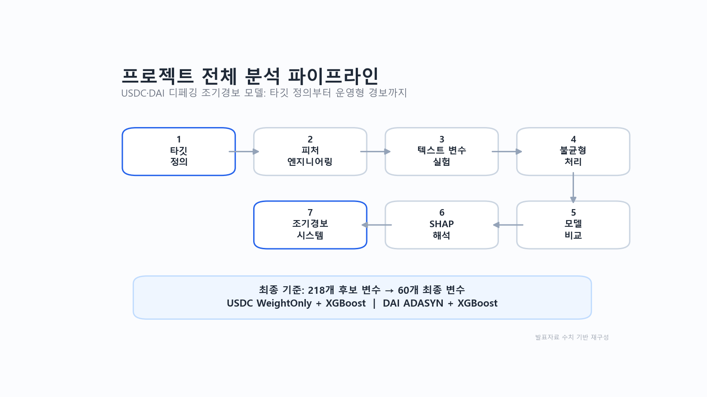
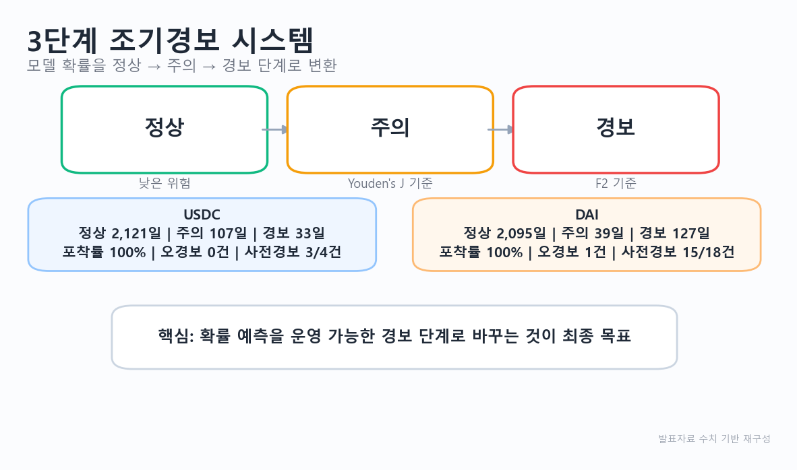
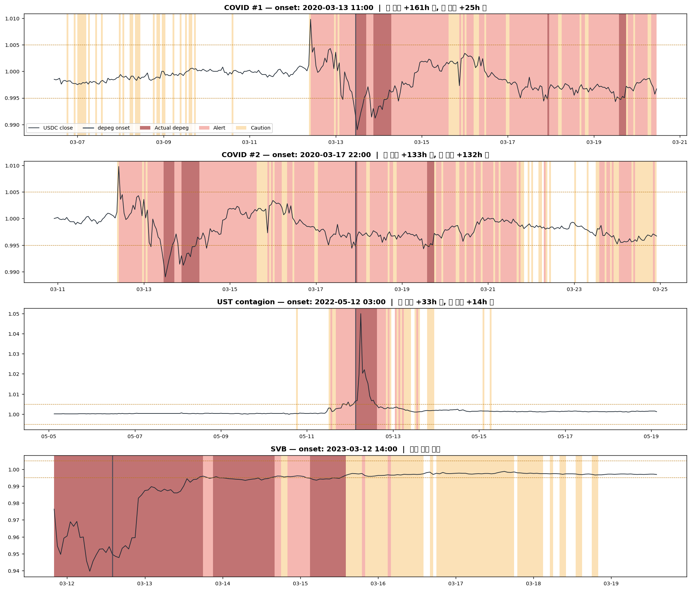
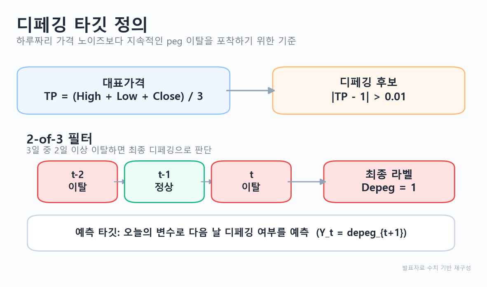
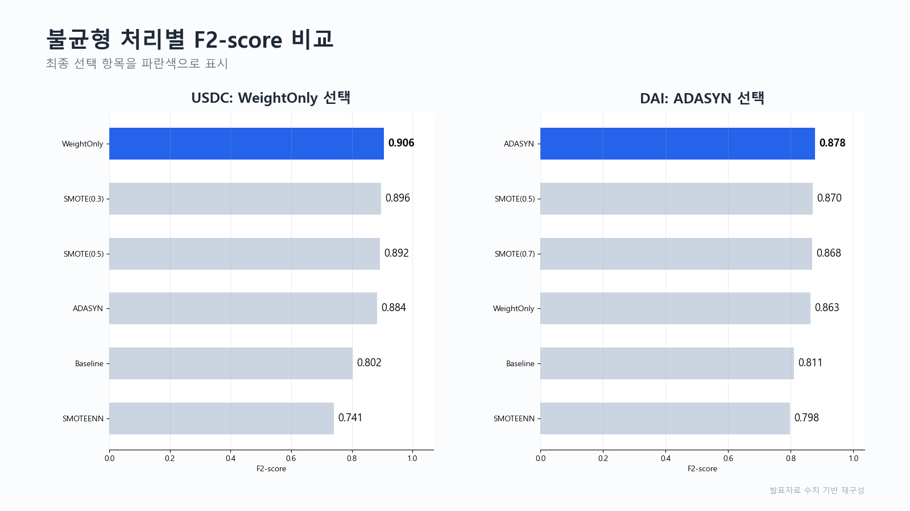
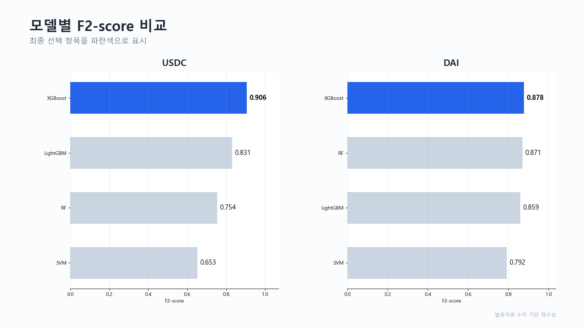
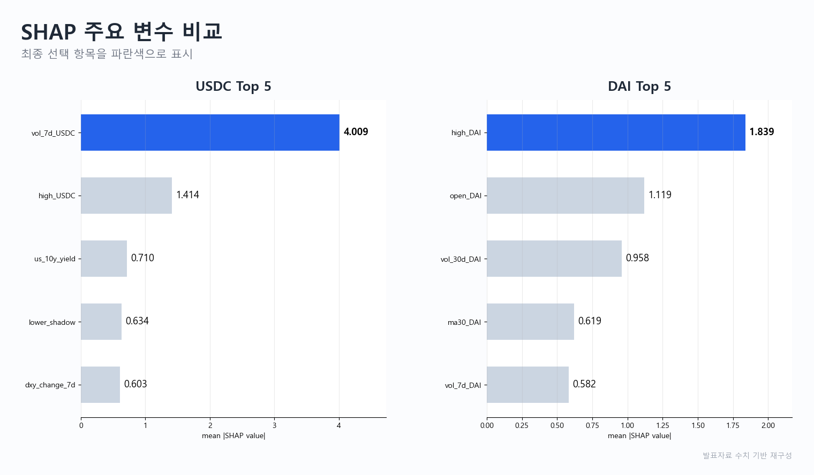

# 스테이블코인 디페깅 조기경보 모델 프로젝트

## Project Overview

이 프로젝트는 USDC와 DAI의 다음 날 디페깅 여부를 예측하고, 예측 확률을 3단계 조기경보로 변환하는 분석입니다. 시장 가격, 거래량, 거시경제, 온체인, DeFi, 검색량, 뉴스 텍스트 후보 변수를 구성한 뒤, 불균형 분류 문제로 모델을 비교했습니다.

분석 기간은 2020-01-01부터 2026-03-25까지입니다. 최종 모델은 USDC와 DAI를 분리해 학습했으며, 주요 평가지표는 F2-score와 Recall입니다.



## Final Performance

최종 발표자료 기준 성능입니다. (StratifiedKFold 5-fold 교차검증)

| Coin | Imbalance Strategy | Model | F2-score | Recall | Precision |
|---|---|---|---:|---:|---:|
| USDC | WeightOnly | XGBoost | **0.906** | 0.900 | 0.975 |
| DAI | ADASYN | XGBoost | **0.878** | 0.905 | 0.788 |

3단계 조기경보 시스템에서 두 코인 모두 디페깅 포착률 100%, USDC 오경보 0건 / DAI 오경보 1건을 달성했습니다.



> 한계: 디페깅 이벤트가 2020년에 집중되어 일반적인 시계열 검증이 어렵습니다. 자세한 내용은 [Limitations](#limitations) 참고.
> **→ 이 한계는 이후 개인 후속 연구(아래 Follow-up)에서 시간단위 재구축으로 해소했습니다.**

## Follow-up: Hourly 재구축으로 시계열 검증 달성 (2026-07, 개인 후속 연구)

팀 프로젝트의 최대 한계였던 "시계열 검증 불가"(양성이 2020년 집중 → walk-forward 시 test에 양성 소멸)를 정면으로 해결한 개인 후속 연구입니다. 상세: [`hourly/docs/hourly_development.md`](hourly/docs/hourly_development.md), [`hourly/docs/multicoin_expansion.md`](hourly/docs/multicoin_expansion.md)

**접근**: 문헌 조사(Curve/BOCD 등) 결과 이 도메인의 표준은 "과거 위기로 학습 → 새 위기로 검증 + lead time + 오경보율"의 이벤트 스터디. 이에 따라 ①Binance 시간단위(1h) 데이터로 재구축(양성이 2020 COVID / 2022 UST 전이 / 2023 SVB 3개 시기로 분산 → walk-forward 성립) ②타깃을 onset 조건화("현재 정상 상태에서 6시간 내 디페깅 **진입**" 예측 — 자명한 지속성 예측 제거) ③sigmoid 캘리브레이션 + 경보예산(주의=위험 상위 5%, 경보=상위 1%) 운영점.

**핵심 결과** (전부 out-of-sample):

| 검증 | 결과 |
|---|---|
| SVB 2023 위기 홀드아웃 (2023 학습 제외) | AUC-PRC 0.88, 주의 recall 0.976 |
| Walk-forward onset (2023) | base rate 0.13% 대비 **lift 278배** |
| 평온 3년(2024~26, 22,084시간) 오경보 | **경보 단 2건** |
| UST 붕괴 cross-coin (UST 미학습 모델) | AUC-PRC 0.893, recall 0.722 |


연도별 walk-forward out-of-sample 타임라인 — 각 연도를 그 이전 데이터만으로 학습한 모델로 예측. 경보(빨강)가 2022-05 UST 전이·2023-03 SVB에 집중되고, 2024년 이후 평온기에는 켜지지 않습니다.



**검증을 통해 얻은 반직관적 발견 3가지** (성능 수치보다 중요한 결과):

1. **무차별 멀티코인 pooling은 해롭다** — 8개 코인(UST·DAI·USDe 등)으로 확장해 pooled 학습 시 자기 코인 위기 탐지가 급락(AUC-PRC 0.407→0.056). 만성 페그 이탈(DAI 2020, TUSD 2024)과 급성 붕괴는 다른 현상 → 코인별 단독 모델 채택. 단 미학습 신규 코인 탐지에는 급성군 pooled가 유효(UST 0.893)
2. **LSTM이 XGBoost에 열세** — 순수 walk-forward에선 대등(0.891 vs 0.881)하나 위기 통째 홀드아웃에서 LSTM 붕괴(0.454 vs 0.880). 희소 양성(~90건)에선 단순한 모델이 견고
3. **일별 거시 변수는 시간단위에서 성능 저하** — 팀 프로젝트의 텍스트 변수와 동일하게 "검증 후 제외" 판단. SHAP 결과 변동성·유동성이 최강 선행신호(일별 분석과 일관)

**정직한 한계**: SVB 사전(pre-onset) lead time은 Binance 결측(2022-09~2023-03 BUSD 전환)이 위기 시작과 겹쳐 측정 불가. 위기 홀드아웃은 실시간 시뮬레이션이 아닌 일반화 시연. 소표본 특성상 AUC는 성능 추정치가 아니라 판별력 시연으로 해석해야 합니다.

## Problem Definition

스테이블코인은 1달러에 고정된 자산처럼 사용되지만, 시장 충격이나 담보 구조 변화가 발생하면 일시적으로 peg가 깨질 수 있습니다. 이 프로젝트의 목적은 디페깅을 사후 설명하는 것이 아니라, 하루 전 관측 가능한 변수로 다음 날 위험 신호를 탐지하는 것입니다.

## Target Definition

최종 발표자료 기준 타깃 정의는 다음과 같습니다.

- Typical Price: `(High + Low + Close) / 3`
- Depeg candidate: `|Typical Price - 1| > 0.01`
- Persistence filter: 3일 중 2일 이상 조건을 만족하면 디페깅 이벤트로 판단
- Prediction target: `Y_t = depeg_{t+1}`

즉, 모델은 오늘의 정보로 다음 날 디페깅 여부를 예측합니다.



## Data Sources

원자료 전체는 저장소에 포함하지 않았습니다. 데이터 출처와 변수 유형은 다음과 같습니다.

- Market data: USDC, DAI, USDT, BTC, ETH 가격, 거래량, 시가총액, 공급량
- Macro data: DXY, VIX, 금리, 신용 스프레드, 유동성 지표
- On-chain and DeFi data: stablecoin supply, MakerDAO, Curve, Aave, lending TVL
- Sentiment and attention data: Google Trends, news text, FinBERT-derived features

API key가 필요한 수집 코드는 이 포트폴리오 레포에 포함하지 않았습니다. 필요한 경우 `.env` 또는 환경변수 방식으로 별도 관리해야 합니다.

## Feature Engineering

후보 변수는 총 218개였습니다. 주요 피처 그룹은 다음과 같습니다.

- Price and volatility: return, rolling volatility, high-low spread, moving average deviation
- Liquidity and volume: volume ratio, turnover, volume shock
- Supply and market cap: supply change, mint/burn proxy, market cap change
- Macro risk: DXY, VIX, rates, credit spread, liquidity stress
- On-chain and DeFi: Curve imbalance, MakerDAO collateral, Aave/DeFi TVL
- Lag features: lag1, lag3, lag7

최종 모델에는 60개 변수를 사용했습니다.

## Text Feature Experiment

뉴스 기반 텍스트 변수는 별도 실험으로 구성했습니다.

- Keyword dictionary features
- LDA topic features
- FinBERT embedding-derived features
- Text features included vs excluded performance comparison

텍스트 변수는 위험 신호 후보로 의미가 있었지만, 최종 F2-score 개선으로 이어지지 않았습니다. 따라서 최종 모델에서는 텍스트 변수를 제외했습니다.

## Imbalanced Data Handling

디페깅은 드문 이벤트이므로 accuracy보다 F2-score와 Recall을 우선했습니다. 불균형 처리 기법을 비교한 뒤 최종 발표 기준은 다음과 같습니다.

| Coin | Imbalance Strategy | Final Model |
|---|---|---|
| USDC | WeightOnly | XGBoost |
| DAI | ADASYN | XGBoost |



## Model Comparison

후보 모델은 Random Forest, XGBoost, LightGBM, SVM 계열을 비교했습니다. 최종 모델은 두 코인 모두 XGBoost로 정리했습니다. 모델 선택 기준은 디페깅 이벤트를 놓치지 않는 능력, 즉 Recall과 F2-score였습니다.



## Key Results

최종 발표 기준의 핵심 결론은 다음과 같습니다.

- USDC와 DAI는 담보 구조와 시장 반응이 달라 개별 모델링이 적합했습니다.
- 단순 정확도보다 F2-score와 Recall이 조기경보 목적에 더 적합했습니다.
- 텍스트 변수는 성능 개선을 만들지 못해 최종 모델에서 제외했습니다.
- 최종 운영 형태는 확률 예측값을 Normal, Caution, Alert로 변환하는 방식입니다.

정량 수치는 원본 실험 산출물 기준으로 해석해야 하며, 이 저장소는 전체 원자료를 포함하지 않으므로 not fully re-executed 상태입니다.

## SHAP Interpretation

SHAP 분석은 최종 tree-based 모델의 예측 근거를 설명하기 위해 사용했습니다. 전역 중요도는 어떤 변수 그룹이 전체적으로 디페깅 예측에 기여했는지 보여주고, 개별 관측치 해석은 특정 날짜의 경보가 어떤 변수 조합으로 발생했는지 확인하는 데 사용했습니다.



USDC는 7일 거래량(vol_7d)·고가 이탈에 더해 미국 10년물 금리·DXY 변화율 같은 거시경제 변수가 상위에 진입해, 거시 충격 → 유동성 급변 → 가격 이탈로 이어지는 전이 경로를 보여줍니다. DAI는 가격/거래량 내부 지표가 중심입니다.

## Early Warning System

모델 출력 확률 `P(depeg)`를 3단계 경보로 변환했습니다.

| Level | Meaning |
|---|---|
| Normal | 디페깅 위험 낮음 |
| Caution | 위험 신호 모니터링 필요 |
| Alert | 디페깅 가능성이 높아 우선 확인 필요 |

Alert 기준은 Recall과 F2-score를 중시해 설정했습니다.

## Limitations

- ~~디페깅 이벤트가 2020년에 집중되어 일반적인 시계열 검증이 어렵습니다.~~ → **Follow-up(hourly 재구축)에서 해소**: 시간단위 전환으로 양성이 3개 시기로 분산되어 walk-forward 검증 성립
- ~~StratifiedKFold는 금융 시계열의 시간 순서를 완전히 반영하지 못합니다.~~ → **Follow-up에서 walk-forward + 위기 홀드아웃(이벤트 스터디)으로 대체**
- 원자료와 API 응답은 시간이 지나며 변경될 수 있습니다.
- hourly 데이터는 저장소에 포함하지 않으며 `hourly/src/collect_*.py`로 무료 API에서 재수집할 수 있습니다.

## My Contribution

- 뉴스 기반 텍스트 파생변수 생성
- 키워드 사전 기반 변수 생성
- LDA 토픽 기반 변수 생성
- FinBERT 임베딩 기반 변수 생성
- 텍스트 변수 포함 전후 성능 비교
- 텍스트 변수가 최종 F2-score를 개선하지 못해 제외된 과정 정리
- 타깃 정의, 변수 설계, 불균형 처리, 모델 평가에 대한 팀 논의 참여
- **Follow-up(hourly 재구축~멀티코인 확장) 전 과정은 팀 프로젝트 종료 후 개인 후속 연구로 수행** (AI 코딩 도구를 활용해 설계·검증·해석 주도)

## Repository Structure

```text
stablecoin-depegging-early-warning/
├── README.md
├── requirements.txt
├── .gitignore
├── docs/
│   ├── project_summary.md
│   ├── data_dictionary.md
│   ├── methodology.md
│   ├── run_order.md
│   └── contribution.md
├── src/
│   ├── 01_preprocess.py
│   ├── 02_prepare_features.py
│   ├── 03_text_features_experiment.py
│   ├── 04_imbalance_experiment.py
│   ├── 05_model_comparison.py
│   ├── 06_shap_analysis.py
│   └── 07_early_warning.py
├── hourly/                     # Follow-up: hourly 재구축 (개인 후속 연구)
│   ├── src/                    # 수집(collect_*) + 파이프라인(h1~h15)
│   ├── docs/                   # 설계·결과·문헌조사 문서
│   └── results/                # 검증 결과 CSV
├── figures/
│   └── hourly/                 # OOS 타임라인, 이벤트 확대, 3단계 경보 등
└── data_sample/
    └── README.md
```

## How to Run

이 저장소는 제출용 정리본이므로 원자료 전체를 포함하지 않습니다. 전체 재실행은 not fully re-executed 상태입니다.

```bash
pip install -r requirements.txt
python src/01_preprocess.py
python src/02_prepare_features.py
python src/03_text_features_experiment.py
python src/04_imbalance_experiment.py
python src/05_model_comparison.py
python src/06_shap_analysis.py
python src/07_early_warning.py
```

실행하려면 별도 `data/raw/`, `data/processed/`, `data/ml/` 구조와 원본 데이터가 필요합니다. 자세한 순서는 `docs/run_order.md`를 참고하세요.

