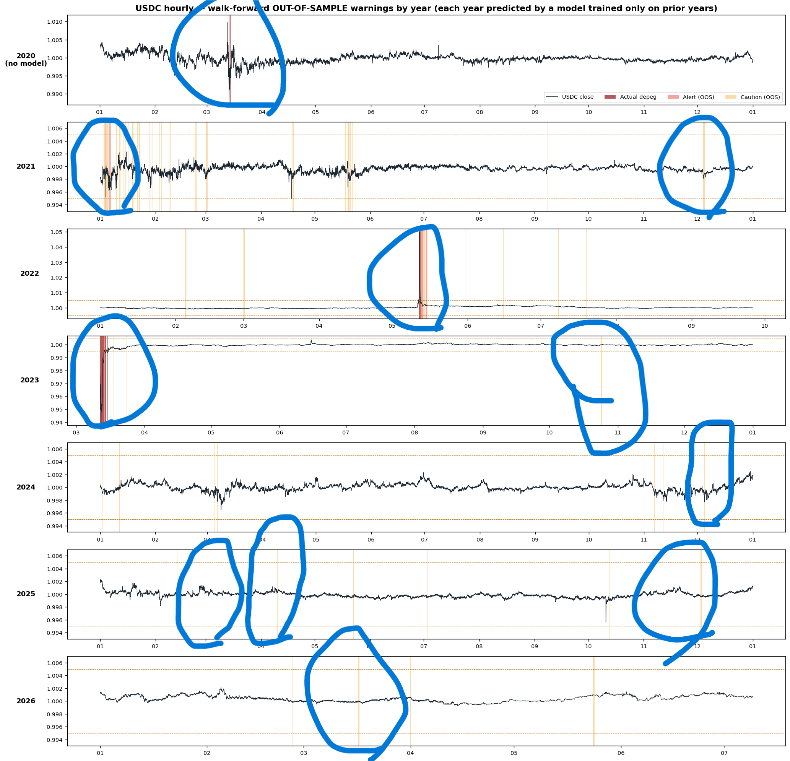

# Follow-up: Hourly Rebuild — 시계열 검증 달성

팀 프로젝트(일별 분석)의 최대 한계였던 **시계열 검증 불가** 문제를 해결한 개인 후속 연구입니다.

## 문제

일별 데이터에서는 USDC 디페깅 양성 33건 중 29건이 2020년에 집중되어, 시간 순서를 지키는 검증(TimeSeriesSplit, Purged K-Fold)에서 test fold에 양성이 거의 남지 않아 평가 자체가 불가능했습니다 (F2 ≈ 0). 이 때문에 팀 프로젝트는 StratifiedKFold(shuffle)를 사용했고, data leakage 가능성이 한계로 남았습니다.

## 접근

문헌 조사 결과, 희귀사건 조기경보 도메인의 표준은 fold 점수 경쟁이 아니라 **이벤트 스터디** — "과거 위기로 학습 → 새 위기로 검증 + lead time + 오경보율" (예: Curve Finance 디페깅 탐지 연구는 2022 UST 붕괴로 학습해 2023 USDC/SVB 디페깅을 5시간 전에 포착). 이에 따라:

1. **시간단위(1h) 재구축** — Binance klines(무료·무인증)로 USDC/BTC/ETH 시간봉 수집. 양성이 2020 COVID / 2022 UST 전이 / 2023 SVB 세 시기로 분산되어 walk-forward가 성립
2. **타깃 재설계** — 종가 기준 `|close−1| > 0.5%` + 2-of-3 persistence (시간봉의 가짜 wick에 강건). **onset 조건화**: 현재 페그 정상 상태에서 "6시간 내 디페깅 *진입*"만 예측 — 이미 디페깅 중인 시점의 자명한 지속성 예측을 제거
3. **검증 프로토콜** — walk-forward(연도별 확장 윈도우, embargo 24h) + 위기 홀드아웃(cross-event). 지표는 AUC-PRC(불균형 대응, 임계값 무관) + base rate 대비 lift
4. **경보 운영점** — sigmoid(Platt) 캘리브레이션(순위 보존) + 경보예산 이중 임계값(주의=위험 상위 5%, 경보=상위 1%)

## 핵심 결과 (전부 out-of-sample)

| 검증 | 결과 |
|---|---|
| SVB 2023 위기 홀드아웃 (2023 학습 제외) | AUC-PRC 0.88, 주의 recall 0.976 |
| Walk-forward onset (2023) | base rate 0.13% 대비 lift **278배** |
| 평온 3년(2024–26, 22,084시간) 오경보 | 경보 **단 2건** |
| UST 붕괴 cross-coin (UST 미학습 모델) | AUC-PRC 0.893, recall 0.722 |



## 검증에서 얻은 발견

1. **무차별 멀티코인 pooling은 해롭다** — 8개 코인(UST·DAI·USDe 등)으로 확장해 pooled 학습하면 자기 코인 위기 탐지가 급락(AUC-PRC 0.407 → 0.056). 만성 페그 이탈(DAI 2020 프리미엄, TUSD 2024)과 급성 붕괴는 다른 현상이므로 **코인별 단독 모델**을 채택. 단, 학습한 적 없는 신규 코인의 위기 탐지에는 급성군 pooled가 유효(UST 0.893)
2. **LSTM < XGBoost** — 순수 walk-forward에선 대등(0.891 vs 0.881)하나, 위기 통째 홀드아웃에서 LSTM이 크게 하락(0.454 vs 0.880). 양성 ~90건의 희소 레짐에서는 단순한 모델이 견고
3. **일별 거시 변수는 시간단위에서 성능 저하** — forward-fill로 주입 시 오히려 하락(레짐 암기/노이즈). SHAP 결과 변동성·유동성이 최강 선행신호로, 일별 분석(vol_7d 1위)과 해상도 불문 일관
4. **주의 임계값 5%의 실증 근거** — 5%→3%로 조이면 UST 전이 탐지가 소실(recall 0.333→0). 평온 3년 주의 점등 133시간(0.6%)은 미묘한 위기 초입을 잡기 위한 비용
5. **seed 앙상블** — 단일 seed 성능에 ±0.04 수준의 운이 섞임을 확인, 5-seed 평균으로 보고 수치의 재현성 확보

## 한계

- **SVB 사전(pre-onset) lead time 측정 불가**: Binance가 2022-09~2023-03(166일) USDC 거래를 중단(BUSD 자동전환)했고 재개 시점이 SVB 위기 시작과 겹침
- **위기 홀드아웃은 실시간 시뮬레이션이 아닌 일반화 시연**: 학습셋에 해당 위기 이후 기간이 포함됨
- **소표본**: 깨끗한 위기 에피소드가 소수이므로 AUC-PRC는 안정적 성능 추정치가 아니라 판별력 시연으로 해석해야 함
- USDCUSDT는 USDT-quote 가격(준-달러 기준). SVB 기간 USDT/USD가 안정(0.999~1.015)이었음을 확인하여 해석을 정당화
- 상방(프리미엄)과 하방(디스카운트) 이탈을 단일 타깃으로 통합 — 경제적 의미가 다르므로 분리는 향후 과제

## 파이프라인

```text
01_collect_binance_hourly.py        USDC/BTC/ETH 1h 수집 (Binance, 무인증)
02_collect_multicoin_hourly.py      UST·BUSD·TUSD·USDP·FDUSD·USDe (Binance) + DAI (Coinbase)
03_build_hourly_dataset.py          wick 정제 → 세그먼트 → 타깃(다중 시계) → 피처
04_walkforward_crossevent_validation.py   walk-forward + 위기 홀드아웃 (τ 파라미터)
05_lstm_vs_xgboost.py               시퀀스 LSTM vs XGBoost 비교
06_threshold_calibration.py         sigmoid 캘리브레이션 + 경보예산 3단계
07_shap_interpretation.py           SHAP 해석 (전체 기간 / 위기 홀드아웃 뷰)
08_seed_ensemble.py                 5-seed 앙상블 (산술 vs 기하평균)
09_build_multicoin_dataset.py       8코인 pooled 데이터셋 (좀비구간 절단, scale-free 피처)
10_pooled_validation.py             leave-one-crisis-out + cross-coin 일반화
11_regime_pooling_onset.py          급성군/만성군 분리 pooling 실험
12_timeline_walkforward_viz.py      연도별 walk-forward OOS 경보 타임라인
13_event_zoom_viz.py                디페깅 에피소드 전후 ±7일 확대
14_caution_budget_tradeoff.py       주의 예산(5/3/2%) 미탐-오탐 트레이드오프
```

데이터 파일은 저장소에 포함하지 않으며, 01–02 수집 스크립트로 무료 API에서 재수집할 수 있습니다. 검증 결과 수치는 [`results/`](results/), 그림은 [`../figures/hourly/`](../figures/hourly/) 참고.
